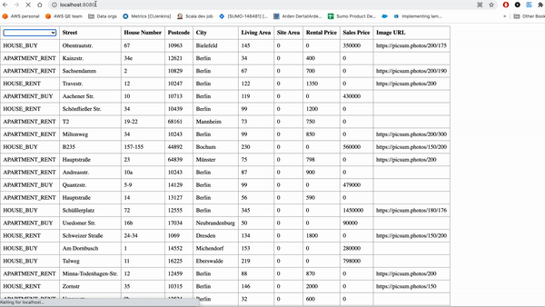

# estate
A small real estate application where you can load, add, save, and filter listings in a browser.

Components used:
- Spring framework `(v2.2.4)` to expose API for CRUD operations. 
- In-memory H2 database `(v1.4)` to store the properties
- React Components to list properties in UI

### APIs supported:
1. `GET /properties/count`  - Total number of properties listed in  the system.
2. `POST /properties`- Post a new property i.e. Add a new property to the list.
3. `GET /properties` - Get all the properties available. This can take 3 parameters to filter the property user want to see.
    - `realEstateType` - The type of property that you want to list. Supported values are:
      - `HOUSE_BUY`, `HOUSE_RENT`, `APARTMENT_BUY`, `APARTMENT_RENT`
    - `minPrice` - the minimum price of the property you want to list
    - `maxPrice` - the minimum price of the property you want to list
    
[_NOTE_] Parameters (minPrice and maxPrice) will work on the price based on the realEstateType

Example: If property is of `BUY` type, it will return properties based on Sales price. 
If property is of `RENT` type, it will return price filtered on rental price

4. `GET /properties/{id}` - Get the detail particular property with listingId.
5. `DELETE /properties/{id}` - Delete the particular property with listingId


##### Schema of the property
```dtd
{  
  "listingId" : Autogenerated Value
  "realEstateType" : string,
  "street" : String,
  "houseNumber" : String,
  "postcode" : String,
  "city" : String,
  "livingArea" : long,
  "siteArea" : long,
  "rentalPrice" : long,
  "salesPrice" : long,
  "imageURL" : "String"
}
```

## How to run the application locally:
### Startup:
- When the applications initialize,
  it loads the h2 database with static list of properties csv from resources folder.


- Base URL for APIs: `http://localhost:8080/`

example request url :
`http://localhost:8080/properties?realEstateType=HOUSE_BUY&minPrice=10&maxPrice=500000`

### Run the Spring application using -

`mvn clean spring-boot:run`


#### For UI:

- Install all the dependencies using

   `npm install`

- Run the webpack server using

  `npx webpack`

   If you want to change the UI components, run the above in watch mode to reflect the change automatically 

   ` npx webpack -w`

#### Run in the browser:
Go to url `http://localhost:8080/` -> This is automatically mapped to load index.html


